# II BOB. REAL VAQTDA O‘QUV PROGRESSINI MONITORING QILUVCHI ANALITIKA TIZIMINI ISHLAB CHIQISH

## 2.1. Tizim arxitekturasi va texnologiyalarni tanlash

Birinchi bobda olib borilgan nazariy tahlil natijasida shakllantirilgan funksional va nofunksional talablarni amalga oshirish uchun, ishlab chiqilayotgan tizimning arxitekturasini to‘g‘ri loyihalash va unga mos texnologiyalar to‘plamini ilmiy asoslangan holda tanlash zarur. Arxitektura — bu dasturiy mahsulotning **fundamental tashkiliy strukturasi** bo‘lib, uning komponentlari, ular o‘rtasidagi munosabatlar hamda muhit bilan o‘zaro aloqasini belgilab beradi (ISO/IEC/IEEE 42010:2011 standartiga muvofiq). Tanlangan arxitekturaviy yondashuv tizimning ishonchliligi, kengayuvchanligi, ishlashi (*performance*) va uni qo‘llab-quvvatlashning oson-qiyinligini bevosita belgilaydi. Shuning uchun mazkur bo‘limda, dastlab zamonaviy dasturiy ta’minot arxitekturalarining qiyosiy tahlili amalga oshiriladi, so‘ngra “Koozat” tizimi uchun eng maqbul model tanlanadi va nihoyat texnologiyalar steki batafsil asoslab beriladi.

**2.1.1. Zamonaviy dasturiy ta’minot arxitekturalarining qiyosiy tahlili.** Hozirgi kunda axborot tizimlarini loyihalashda asosiy uchta arxitekturaviy yondashuv keng qo‘llaniladi: an’anaviy uch qatlamli (*three-tier*), mikroservisli (*microservices*) va serversiz (*serverless* yoki BaaS — *Backend-as-a-Service*) modellar.

*An’anaviy uch qatlamli arxitektura* taqdimot qatlami (foydalanuvchi interfeysi), biznes-mantiq qatlami (server) va ma’lumotlar qatlami (ma’lumotlar bazasi) o‘rtasida vazifalarni aniq taqsimlaydi. Bu modelning afzalligi — mantiqning markazlashganligi va xavfsizlikning yuqori darajadagi nazoratidir. Biroq u o‘zining kamchiliklariga ham ega: serverni mustaqil qo‘llab-quvvatlash, masshtablashda qo‘shimcha sarflar, real vaqtli ma’lumot uzatish uchun maxsus mexanizmlar (WebSocket, Server-Sent Events) qurishni talab etadi.

*Mikroservisli arxitektura* — tizimni mustaqil, bir-biriga bo‘shashtirilgan kichik xizmatlarga (*loosely coupled microservices*) ajratishni nazarda tutadi. Har bir mikroservis o‘ziga tegishli ma’lumotlar bazasiga ega bo‘ladi va REST yoki gRPC orqali muloqot qiladi. Bu yondashuv yirik korporativ tizimlar uchun ideal hisoblansa-da, kichik va o‘rta hajmdagi ta’lim ilovalari uchun haddan tashqari murakkab, qo‘shimcha *DevOps* infratuzilmasini va konteyner orkestratsiyasini (Kubernetes, Docker Swarm) talab qiladi.

*Serverless / BaaS arxitekturasi* — so‘nggi yillarda eng tez rivojlanayotgan yondashuv bo‘lib, dasturchi serverni boshqarish, masshtablashtirish va monitoring qilish vazifalaridan butunlay xalos bo‘ladi. *Backend-as-a-Service* xizmati orqali avtentifikatsiya, ma’lumotlar bazasi, fayl saqlash, push-bildirishnomalar va boshqa zarur funksiyalar tayyor xizmat (*managed service*) sifatida taqdim etiladi. Hisob-kitoblar haqiqiy iste’molga (*pay-per-use*) qarab amalga oshiriladi, bu kichik loyihalar uchun iqtisodiy jihatdan juda foydali. *Google Firebase*, *AWS Amplify*, *Supabase* va *Appwrite* bu sohadagi yetakchi platformalardir.

“Koozat” tizimi quyidagi sabablarga ko‘ra **serverless / BaaS arxitekturasi** asosida quriladi:
1. **Real vaqtli sinxronizatsiya** BaaS-platformalarda “qutidan tashqarida” (*out-of-the-box*) qo‘llab-quvvatlanadi va alohida WebSocket-server ishlab chiqishni talab etmaydi;
2. **Past joriy etish to‘sig‘i** — ta’lim muassasalarining IT-bo‘limlari uchun mustaqil server xarid qilish va sozlash shart emas;
3. **Avtomatik masshtablash** — foydalanuvchilar soni 10 dan 10 000 gacha o‘sganida ham infratuzilma o‘zgartirishlarsiz ishlay oladi;
4. **Xavfsizlik va ishonchlilik** dunyo darajasidagi xizmat ko‘rsatuvchi tomonidan ta’minlanadi (SOC 2, ISO 27001 sertifikatlari);
5. **Tezkor rivojlantirish davri** — diplom loyihasi doirasidagi cheklangan vaqt resursi sharoitida muhim afzallik.

**2.1.2. Tizimning umumiy arxitekturaviy modeli.** “Koozat” tizimi to‘rt asosiy qatlamdan iborat (1-rasmga qarang):

1. **Taqdimot qatlami (*Presentation Layer*)** — Flutter framework asosida qurilgan, Android, iOS va veb-platformalarda yagona kod bazasidan ishlovchi foydalanuvchi interfeysi. Bu qatlam *widget tree* ko‘rinishida tashkil qilingan reaktiv komponentlar to‘plami sifatida ishlaydi.

2. **Domen va biznes-mantiq qatlami (*Domain Layer*)** — domen modellari (entitylar), *use case*’lar va biznes-qoidalardan iborat. Bu qatlam *Clean Architecture* tamoyiliga muvofiq, tashqi qatlamlardan mustaqil ravishda yozilgan va testlash imkoniyati yuqori.

3. **Ma’lumotlar qatlami (*Data Layer*)** — repozitoriy interfeyslari (`AttendanceRepository`, `GradeRepository`, `UserRepository`) va ularning Firebase-implementatsiyalaridan tashkil topgan. Bu qatlam ma’lumotlar bazasidagi xom (*raw*) ma’lumotlarni domen-obyektlariga (DTO → Domain Entity) o‘giradi va aksincha.

4. **Bulutli infratuzilma qatlami (*Cloud Infrastructure Layer*)** — Firebase Authentication, Cloud Firestore, Firebase Cloud Messaging va Firebase Hosting xizmatlari to‘plami. Bu qatlam tizimning eng past darajasi bo‘lib, dasturchi tomonidan kod yozilmaydi, faqat konfiguratsiya va xavfsizlik qoidalari (*security rules*) sozlanadi.

Qatlamlar o‘rtasidagi aloqa **yo‘naltirilgan bog‘liqlik** (*dependency rule*) tamoyili asosida tashkil etilgan: ichki qatlamlar tashqi qatlamlar haqida hech qanday ma’lumotga ega emas. Bu Uncle Bob (Robert C. Martin) tomonidan taklif etilgan *Clean Architecture* tamoyili bo‘lib, kodning tozaligi, testlashga moslashuvchanligi va kelajakda almashtirish mumkinligini ta’minlaydi.

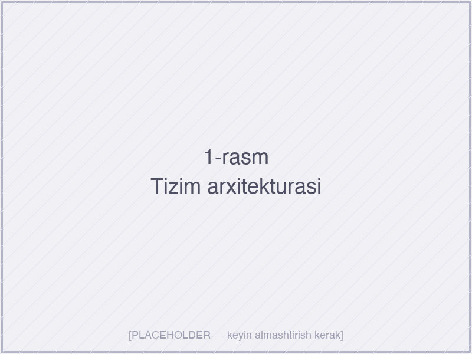

*1-rasm. “Koozat” tizimining to‘rt qatlamli arxitektura sxemasi: Presentation (Flutter), Domain (use cases), Data (repositories) va Cloud Infrastructure (Firebase)*

**2.1.3. Frontend texnologiya tanlovi: Flutter.** Mobil va veb platformalarni qoplaydigan zamonaviy *cross-platform* texnologiyalar orasida uchta yetakchi mavjud: **React Native** (Meta), **Flutter** (Google) va **Kotlin Multiplatform** (JetBrains).

| Mezon | Flutter | React Native | Native (Swift/Kotlin) |
|-------|---------|--------------|------------------------|
| Yagona kod bazasi | Ha (Dart) | Ha (JavaScript/TS) | Yo‘q (alohida) |
| Ishlash unumdorligi | Yuqori (Skia/Impeller renderer) | O‘rtacha (JS bridge) | Eng yuqori |
| Hot Reload | Bor (~1 s) | Bor (~2 s) | Yo‘q |
| Veb-platforma qo‘llovi | Bor (rasmiy) | Cheklangan | Yo‘q |
| Mahalliylashtirish qulayligi | Yuqori | Yuqori | Yuqori |
| Bozordagi pasayish riski | Past (Google qo‘llab-quvvatlaydi) | O‘rtacha | Eng past |
| O‘rganish bahosi | O‘rta (Dart yangi) | Past (JS keng tarqalgan) | Yuqori |

**Flutter tanlovining sabablari** quyidagilardan iborat:

- **Yagona kod bazasi**, Android, iOS, veb va hatto desktop platformalarini qoplaydi, bu esa diplom loyihasi doirasida vaqtni uch baravar tejaydi;
- **Skia / Impeller** grafik dvigatellari yordamida real *native* tezlikda ishlash unumdorligi (60 FPS, ba’zi qurilmalarda 120 FPS);
- **Reaktiv UI modeli** Firebase’ning *snapshot streams* mexanizmiga bevosita mos keladi — har bir Firestore yangilanishi avtomatik ravishda *widget tree*’da ko‘rinadi;
- **Material Design 3** dizayn tizimi rasmiy qo‘llab-quvvatlanadi — bu zamonaviy ko‘rinish va foydalanuvchi tajribasini ta’minlaydi;
- **Boy ekotizim** — *pub.dev* repozitoriysida 40 000 dan ortiq paket mavjud, jumladan, Firebase bilan ishlash uchun rasmiy `firebase_core`, `cloud_firestore`, `firebase_auth` paketlari;
- **Aniq tipizatsiyalangan til (Dart)** — kompilyatsiya vaqtidagi xatolarni aniqlash, kod ishonchliligini oshiradi;
- **Hot Reload va Hot Restart** — kodga kiritilgan o‘zgarishlarni ~1 soniyada ko‘rishi mumkin, bu rivojlantirish samaradorligini sezilarli darajada oshiradi.

**2.1.4. Backend texnologiya tanlovi: Firebase.** Backend-as-a-Service sohasida Firebase yetakchi pozitsiyani egallaydi (2024-yil holatiga ko‘ra). Uning asosiy raqobatchilari — Supabase (PostgreSQL asosida ochiq manbali alternativ), AWS Amplify (kuchli, lekin murakkab konfiguratsiya) va Appwrite. Quyidagi jadvalda ularning qiyosiy tahlili keltirilgan:

| Mezon | Firebase | Supabase | AWS Amplify |
|-------|----------|----------|-------------|
| Ma’lumotlar bazasi tipi | NoSQL (Firestore) | SQL (Postgres) | Ikkalasi ham |
| Real vaqtli sinxronizatsiya | Native, juda kuchli | Kuchli | Murakkabroq sozlash |
| Avtomatik masshtablash | Ha, cheksiz | Cheklangan | Ha |
| Bepul tarif | Saxiy (Spark plan) | Saxiy | Cheklangan |
| Flutter integratsiyasi | Eng yetuk (rasmiy SDK) | Yaxshi | O‘rta |
| Offlayn rejim | Native qo‘llab-quvvatlash | Cheklangan | Mavjud |
| Hujjatlashtirish sifati | Juda yuqori | Yuqori | O‘rta |

**Firebase to‘plamining tanlangan komponentlari**:

1. **Firebase Authentication** — email/parol, Google Sign-In, Apple Sign-In va boshqa autentifikatsiya usullari rasmiy qo‘llab-quvvatlanadi. Foydalanuvchining xavfsiz sessiya boshqaruvi (JWT tokenlar) avtomatik tarzda ta’minlanadi. *Custom claims* mexanizmi orqali foydalanuvchiga rol (talaba/o‘qituvchi/administrator) biriktirish mumkin.

2. **Cloud Firestore** — hujjat-yo‘naltirilgan NoSQL ma’lumotlar bazasi. U real vaqtli yangilanishlar uchun `snapshotChanges()` mexanizmini taqdim etadi. Ma’lumotlar **kolleksiyalar → hujjatlar → kichik kolleksiyalar** ierarxiyasida saqlanadi. Firestore quyidagi noyob xususiyatlarga ega:
   - **Real-time listeners** — har qanday so‘rovga obuna bo‘lish va o‘zgarishlarni avtomatik olish;
   - **Offline persistence** — internet aloqasi uzilganda ham ma’lumotlar mahalliy keshda saqlanadi;
   - **ACID transaksiyalar** va *batched writes* — ma’lumotlar yaxlitligini ta’minlash uchun;
   - **Security Rules** — server-tomonida tekshiriladigan deklarativ xavfsizlik qoidalari.

3. **Firebase Cloud Messaging (FCM)** — push-bildirishnomalarni Android, iOS va veb-platformalarga yetkazib berish uchun yagona API. “Koozat” tizimida o‘qituvchining yangi baho qo‘yganligi, davomat o‘zgartirilganligi yoki “xavf zonasidagi” talaba aniqlanganligi haqida real vaqtli bildirishnomalar yuborish uchun foydalaniladi.

4. **Firebase Hosting** — Flutter veb ilovasini *Global CDN* orqali tarqatish uchun. SSL sertifikati avtomatik berishi va *atomic deploys* qo‘llab-quvvatlash bilan.

5. **Firebase Analytics** — foydalanuvchilarning ilova bilan o‘zaro aloqasini tahlil qilish uchun, lekin bu tahlil tizimning o‘zining ichki o‘quv analitikasidan farqlanadi.

**2.1.5. Yordamchi vositalar va kutubxonalar.** Asosiy texnologiyalardan tashqari, “Koozat” tizimini ishlab chiqishda quyidagi yordamchi vositalar va Dart-paketlaridan foydalaniladi:

- **`flutter_riverpod` 2.x** — kompleks holatni boshqarish (*state management*) uchun. *Provider* paketining kelajakdagi vorisi sifatida tanlangan: kompilyatsiya vaqtida xavfsiz, testlashga moslashtirilgan;
- **`go_router` 13.x** — deklarativ yo‘naltirish (*routing*), veb va mobil platformalarda bir xil URL-strukturani saqlaydi;
- **`fl_chart` / `syncfusion_flutter_charts`** — diagrammalar va vizualizatsiya uchun;
- **`freezed` + `json_serializable`** — o‘zgarmas (*immutable*) ma’lumotlar modellari va JSON serializatsiyasi uchun kod generatsiyasi;
- **`intl`** — lokalizatsiya va ko‘p tilli interfeysni qo‘llab-quvvatlash uchun;
- **Visual Studio Code + Flutter va Dart kengaytmalari** — IDE sifatida;
- **Git va GitHub** — versiyalar nazorati va kod hostingi uchun;
- **Figma** — UI/UX mokaplar va dizayn tizimi uchun.

**Bo‘lim bo‘yicha xulosa.** Mazkur paragrafda tizim arxitekturasi va texnologiyalar steki bo‘yicha ilmiy asoslangan tanlov amalga oshirildi. Tizim *serverless / BaaS* arxitekturasi va *Clean Architecture* tamoyillari asosida to‘rt qatlamli model ko‘rinishida loyihalanadi. Frontend texnologiyasi sifatida **Flutter (Dart)**, backend uchun esa **Firebase to‘plami** tanlandi. Bu tanlov real vaqtli sinxronizatsiya, mobil-birinchi yondashuv, past joriy etish to‘sig‘i va avtomatik masshtashlash bo‘yicha I bobda aniqlangan barcha talablarga to‘liq javob beradi.

## 2.2. Flutter, Firebase yordamida “Koozat” analitik tizimini ishlab chiqish

Mazkur bo‘limda yuqorida tanlangan texnologiyalar steki asosida “Koozat” tizimining dasturiy ta’minoti qanday ishlab chiqilganligi bosqichma-bosqich yoritiladi. Ishlab chiqish jarayoni *Agile* metodologiyasining moslashtirilgan *Scrum*-variantida olib borildi: ish 2 haftalik *sprint*’larga ajratildi, har bir sprint oxirida ishlovchi prototip taqdim etildi.

**2.2.1. Loyiha tuzilmasi va kod tashkili.** Flutter loyihasi quyidagi modulli papka tuzilishida tashkillashtirildi (*feature-first* yondashuvi *Clean Architecture* bilan birlashtirildi):

```
lib/
├── core/                 # Umumiy kutubxonalar
│   ├── constants/        # Doimiy qiymatlar (ranglar, matnlar, o‘lchamlar)
│   ├── errors/           # Xato turlari va istisno (*exception*) sinflari
│   ├── network/          # Internet aloqasi tekshiruvchisi
│   ├── theme/            # Material 3 mavzu konfiguratsiyasi
│   └── utils/            # Yordamchi funksiyalar
├── features/             # Funksional modullar
│   ├── auth/             # Autentifikatsiya
│   │   ├── data/         # Repozitoriy implementatsiyasi
│   │   ├── domain/       # Domen modellari, use case’lar
│   │   └── presentation/ # Ekranlar, widgetlar, controllerlar
│   ├── attendance/       # Davomat moduli
│   ├── grades/           # Baholash moduli
│   ├── analytics/        # Analitik panellar
│   └── notifications/    # Bildirishnomalar
├── shared/               # Bir nechta funksiyalar uchun umumiy widgetlar
└── main.dart             # Ilovaning kirish nuqtasi
```

Bunday tuzilma har bir funksional modulni alohida ko‘chirish, sinash va parallel ravishda rivojlantirishga imkon beradi. Yangi a’zo loyihaga qo‘shilganida, faqat o‘ziga tegishli modul bilan tanishishi yetarli bo‘ladi.

**2.2.2. Cloud Firestore ma’lumotlar modelini loyihalash.** NoSQL ma’lumotlar bazasini loyihalashning klassik munozarali masalasi — *embedding vs. referencing* (joylash yoki havola berish) muammosi. Firestore o‘qishlar uchun yuqori, yozishlar uchun esa nisbatan ko‘proq xarajat oladi (har bir hujjat o‘qilishi alohida hisoblanadi). Shu sababli ma’lumotlar shunday tarzda tashkillashtirildi:

- **Tez-tez birga o‘qiladigan** kichik hajmdagi ma’lumotlar (masalan, foydalanuvchi va uning bir nechta sozlamalari) bitta hujjatga joylashtiriladi;
- **Mustaqil ravishda yangilanadigan** va katta hajmli ma’lumotlar (masalan, talabaning barcha davomatlari) alohida kolleksiyada saqlanadi va ID orqali bog‘lanadi.

Asosiy kolleksiyalar tuzilmasi quyidagicha:

```
users/{userId}
  ├─ email: string
  ├─ displayName: string
  ├─ role: "student" | "teacher" | "admin"
  ├─ photoURL: string?
  ├─ createdAt: timestamp
  └─ courses: array<courseId>     // talaba/o‘qituvchi a’zo bo‘lgan kurslar

courses/{courseId}
  ├─ title: string
  ├─ description: string
  ├─ teacherId: string             // users hujjatga havola
  ├─ studentIds: array<userId>
  ├─ schedule: map
  └─ createdAt: timestamp

courses/{courseId}/sessions/{sessionId}    // dars sessiyalari
  ├─ date: timestamp
  ├─ topic: string
  ├─ status: "scheduled" | "ongoing" | "ended"
  └─ attendance: map<studentId, "present" | "absent" | "late">

courses/{courseId}/grades/{gradeId}
  ├─ studentId: string
  ├─ assignmentType: "quiz" | "midterm" | "final" | "homework"
  ├─ score: number
  ├─ maxScore: number
  ├─ weight: number
  ├─ feedback: string?
  └─ gradedAt: timestamp

activity_logs/{logId}              // foydalanuvchi faolligi jurnali
  ├─ userId: string
  ├─ courseId: string?
  ├─ action: string
  ├─ metadata: map
  └─ timestamp: timestamp

analytics_cache/{userId}_{courseId}   // hisoblangan analitik ko‘rsatkichlar keshi
  ├─ upi: number                       // Umumiy Progress Indeksi (0..100)
  ├─ riskIndex: number                 // Risk Indeksi (0..1)
  ├─ attendanceRate: number
  ├─ avgGrade: number
  ├─ trendDirection: "up" | "stable" | "down"
  └─ updatedAt: timestamp
```

Maxsus e’tibor `analytics_cache` kolleksiyasiga qaratilgan: real vaqtli analitika hisoblari har bir o‘qish so‘rovida qaytadan amalga oshirilsa, bu Firestore so‘rovlar sonini va ilova javob vaqtini sezilarli darajada oshirib yuboradi. Buning oldini olish uchun analitik ko‘rsatkichlar **Firebase Cloud Functions** orqali fon rejimida hisoblanadi va `analytics_cache`’da saqlanadi. O‘qituvchining paneli faqat ushbu keshdan o‘qiydi, bu esa o‘qish xarajatini ~80% ga kamaytiradi.

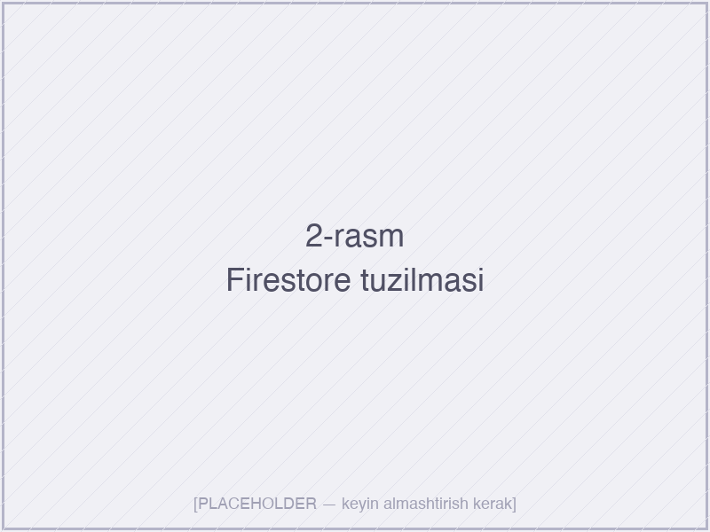

*2-rasm. “Koozat” tizimining Cloud Firestore ma’lumotlar bazasidagi asosiy kolleksiyalar tuzilmasi (Firebase Console skrinshoti)*

**2.2.3. Xavfsizlik qoidalarini sozlash.** Firestore Security Rules — server tomonida tekshiriladigan, deklarativ tilda yozilgan qoidalar to‘plami. Ulanish autentifikatsiyasi, foydalanuvchining roli va ma’lumotlarga kirishning aniq sharti shu yerda belgilanadi. “Koozat” loyihasida quyidagi tamoyillarga rioya qilindi:

- **Eng kam huquqlar tamoyili (*principle of least privilege*)** — har bir foydalanuvchi faqat o‘ziga zarur bo‘lgan ma’lumotlarga kirishi mumkin;
- **Server tomonidagi tekshirish** — mijoz tomonidagi tekshirishlarga ishonmaslik, har bir yozish so‘roviga qoidalar tomonidan ruxsat berilishi shart;
- **Audit jurnali** — barcha muhim amallar `activity_logs` kolleksiyasiga yoziladi.

Misol uchun, talabaning bahosini faqat shu kursning o‘qituvchisi yoki administrator o‘zgartirishi mumkin degan qoida quyidagicha yoziladi:

```javascript
match /courses/{courseId}/grades/{gradeId} {
  allow read: if request.auth.uid == resource.data.studentId
              || isTeacherOfCourse(courseId)
              || isAdmin();
  allow create, update: if isTeacherOfCourse(courseId);
  allow delete: if isAdmin();
}

function isTeacherOfCourse(courseId) {
  return get(/databases/$(database)/documents/courses/$(courseId))
           .data.teacherId == request.auth.uid;
}
```

**2.2.4. Autentifikatsiya modulini ishlab chiqish.** Foydalanuvchini ro‘yxatdan o‘tkazish va tizimga kirish jarayoni Firebase Authentication’ning email/parol va Google Sign-In provayderlari orqali amalga oshiriladi. Dart tilida bu jarayon `firebase_auth` paketi yordamida quyidagi tarzda yozilgan (loyihadan parcha):

```dart
class FirebaseAuthRepository implements AuthRepository {
  final FirebaseAuth _auth;
  final FirebaseFirestore _firestore;

  FirebaseAuthRepository(this._auth, this._firestore);

  @override
  Future<Result<AppUser>> signIn(String email, String password) async {
    try {
      final credential = await _auth.signInWithEmailAndPassword(
        email: email,
        password: password,
      );
      final userDoc = await _firestore
          .collection('users')
          .doc(credential.user!.uid)
          .get();

      if (!userDoc.exists) {
        return Result.failure(AppError.userNotFound());
      }
      return Result.success(AppUser.fromFirestore(userDoc));
    } on FirebaseAuthException catch (e) {
      return Result.failure(_mapAuthException(e));
    }
  }
}
```

Bu kod parchasida quyidagi tamoyillar amalga oshirilgan:

- **`Result<T>` patterni** — `try/catch` o‘rniga, muvaffaqiyat va xatolikni aniq qaytaradi (Rust va Kotlin tillaridan ilhom olingan);
- **Repozitoriy interfeysi** (`AuthRepository`) domen qatlamida e’lon qilingan, implementatsiya esa data qatlamida — bu *Dependency Inversion* tamoyiliga muvofiq;
- **Firestore-spetsifik istisnolar** umumiy `AppError` turiga o‘giriladi, bu domen qatlamida Firebase haqidagi bilim talab qilmaslikni ta’minlaydi.

Autentifikatsiya modulining vizual ko‘rinishi 3- va 4-rasmlarda keltirilgan. Tizimga kirish ekrani sodda, bitta vazifaga yo‘naltirilgan; ro‘yxatdan o‘tishda foydalanuvchi o‘z rolini (talaba yoki o‘qituvchi) tanlashi shart.

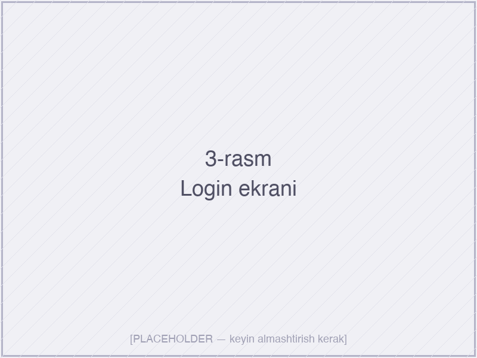

*3-rasm. “Koozat” tizimining mobil versiyasidagi Login ekrani*

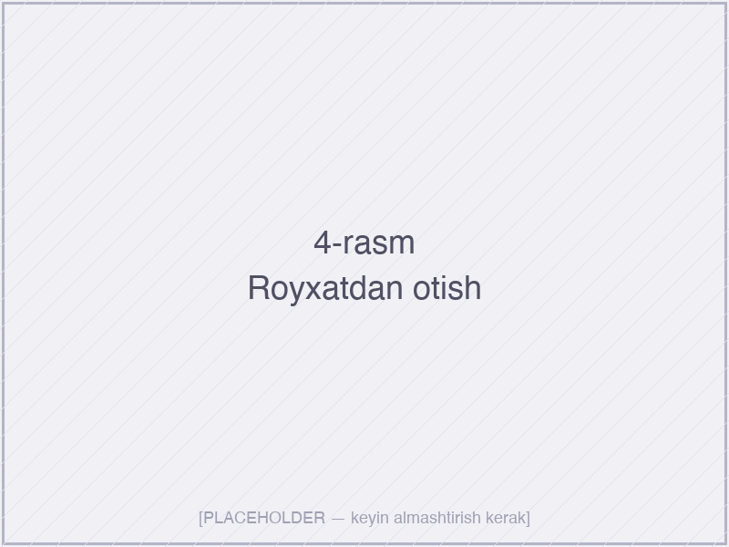

*4-rasm. Yangi foydalanuvchini ro‘yxatdan o‘tkazish ekrani — rol tanlash interfeysi*

**2.2.5. Real vaqtli sinxronizatsiya: StreamBuilder va Riverpod birlashtirilgan ishlatish.** Tizimning yuragi — bu Firestore’dan keladigan real vaqtli yangilanishlarning interfeysga avtomatik aks etishidir. Flutter’da bu ikki mexanizm yordamida amalga oshiriladi:

1. **`Stream<QuerySnapshot>`** — Firestore tomonidan taqdim etiladigan oqim, har qanday hujjat o‘zgarganda yangi snapshot uzatadi;
2. **Riverpod `StreamProvider`** — bu oqimni ilovaning butun davomida boshqaradigan reaktiv provider.

Misol uchun, o‘qituvchining boshqaruv paneli talabalarning real vaqtli ro‘yxatini ko‘rsatadi (parcha):

```dart
final courseStudentsProvider = StreamProvider.family<List<StudentProgress>, String>(
  (ref, courseId) {
    return FirebaseFirestore.instance
        .collection('analytics_cache')
        .where('courseId', isEqualTo: courseId)
        .orderBy('riskIndex', descending: true) // xavfli talabalar tepada
        .snapshots()
        .map((snapshot) => snapshot.docs
            .map((doc) => StudentProgress.fromFirestore(doc))
            .toList());
  },
);
```

Foydalanuvchi interfeysida (widget tomonida) bu provider quyidagicha iste’mol qilinadi:

```dart
class TeacherDashboard extends ConsumerWidget {
  final String courseId;
  const TeacherDashboard({required this.courseId});

  @override
  Widget build(BuildContext context, WidgetRef ref) {
    final studentsAsync = ref.watch(courseStudentsProvider(courseId));

    return studentsAsync.when(
      data: (students) => StudentRiskListView(students: students),
      loading: () => const CircularProgressIndicator(),
      error: (e, st) => ErrorView(error: e),
    );
  }
}
```

Bu konstruksiyaning eng muhim afzalligi shundaki, talabaning baholaridagi yoki davomatidagi har qanday o‘zgarish (boshqa o‘qituvchi tomonidan kiritilgan bo‘lsa ham), 1–2 soniya ichida barcha ulangan qurilmalarning ekranida avtomatik aks etadi — hech qanday “Yangilash” tugmasini bosish kerak emas.

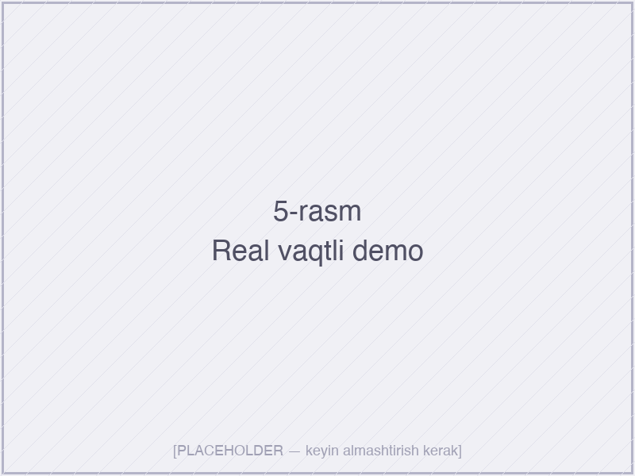

*5-rasm. Real vaqtli ma’lumot sinxronizatsiyasining ko‘rgazmali demonstratsiyasi: o‘qituvchi qurilmasida (chap) baho qo‘yiladi, talaba qurilmasida (o‘ng) 1–2 soniya ichida darhol ko‘rinadi*

**2.2.6. Analitik ko‘rsatkichlarning hisoblanishi.** I bobda taklif etilgan kompozit indekslar — **Umumiy Progress Indeksi (UPI)** va **Risk Indeksi (RI)** — Cloud Functions yordamida fon rejimida hisoblanadi. Cloud Functions — bu serversiz hisoblash mexanizmi bo‘lib, Firestore’dagi hujjat yangilanishiga avtomatik javob beradi.

UPI hisoblash formulasi quyidagicha (TypeScript):

```typescript
export const computeUPI = functions.firestore
  .document('courses/{courseId}/grades/{gradeId}')
  .onWrite(async (change, context) => {
    const { courseId } = context.params;
    const gradeData = change.after.data();
    if (!gradeData) return;

    const studentId = gradeData.studentId;
    const attendanceRate = await calcAttendanceRate(courseId, studentId);
    const avgGrade = await calcAvgGrade(courseId, studentId);
    const activityScore = await calcActivityScore(courseId, studentId);

    // UPI = 0.30 * davomat + 0.50 * baho + 0.20 * faollik
    const upi = 0.30 * attendanceRate + 0.50 * avgGrade + 0.20 * activityScore;

    // Risk indeksi — UPI past bo‘lganda, oxirgi 14 kunlik tendentsiya
    // pasayganda yoki davomat 70%dan kam bo‘lganda yuqori bo‘ladi
    const riskIndex = computeRisk({ upi, attendanceRate, trend: ... });

    await admin.firestore()
      .collection('analytics_cache')
      .doc(`${studentId}_${courseId}`)
      .set({
        upi, riskIndex, attendanceRate, avgGrade,
        updatedAt: admin.firestore.FieldValue.serverTimestamp(),
      }, { merge: true });
  });
```

Vazn koeffitsiyentlari (0.30 / 0.50 / 0.20) I bobdagi nazariy tahlilga asoslanib tanlangan: baho akademik o‘zlashtirishni eng kuchli ko‘rsatkich sifatida (50%), davomat ishtirok darajasi (30%) va faollik motivatsiya ko‘rsatkichi (20%) sifatida hisobga olinadi. Bu koeffitsiyentlar kelajakda ta’lim muassasasining ehtiyojiga qarab sozlash imkoniyatiga ega bo‘lishi rejalashtirilgan.

**2.2.7. Push-bildirishnomalar moduli.** Firebase Cloud Messaging orqali quyidagi to‘rt turdagi avtomatik bildirishnomalar yuboriladi:

1. **Yangi baho** — o‘qituvchi baho qo‘yganda, talaba va uning roditellari (ihtiyoriy) xabar oladi;
2. **Davomat o‘zgartirildi** — talaba “kelmagan” deb belgilangan bo‘lsa, darhol xabar yuboriladi;
3. **Risk ogohlantirishi** — talabaning Risk Indeksi 0,7 dan oshganda, o‘qituvchi va talabaga ogohlantiruvchi xabar;
4. **Eslatmalar** — yaqinlashayotgan topshiriqlar, imtihonlar haqida.

Bu bildirishnomalar Cloud Function ichidagi `admin.messaging().send()` chaqiruvi orqali yuboriladi, mobil ilovada esa `firebase_messaging` paketi orqali qabul qilinadi va `flutter_local_notifications` orqali ko‘rsatiladi.

**Bo‘lim bo‘yicha xulosa.** Mazkur paragrafda “Koozat” tizimining dasturiy ta’minotini ishlab chiqishning asosiy bosqichlari — loyiha strukturasi, Firestore ma’lumotlar modeli, xavfsizlik qoidalari, autentifikatsiya, real vaqtli sinxronizatsiya mexanizmi, analitik hisob-kitoblar va bildirishnomalar — batafsil yoritildi. Tizim **Clean Architecture** tamoyillariga muvofiq qurilgan, `Result<T>` patterni va Riverpod yordamida boshqariladigan reaktiv oqimlar asosida ishlaydi. Cloud Functions orqali hisob-kitoblarni fon rejimida amalga oshirish strategiyasi Firestore o‘qish xarajatlarini sezilarli darajada kamaytirdi.

## 2.3. Foydalanuvchi interfeysi (UI/UX) va tizimning amaliy implementatsiyasi

Dasturiy ta’minotning texnik mukammalligi qanchalik yuqori bo‘lmasin, foydalanuvchi interfeysi (UI) va foydalanish tajribasi (UX) yetarlicha o‘ylab tuzilmagan bo‘lsa, tizim amaliyotda qabul qilinmaydi. Ayniqsa ta’lim sohasida foydalanuvchilarning ko‘pchiligi *digital native* avlodga mansub bo‘lib, ular o‘zlarining shaxsiy sotsial tarmoq ilovalari darajasidagi qulaylikni kutadilar. Shu sababli mazkur paragrafda UI/UX loyihalashning ilmiy yondashuvi va “Koozat” tizimining vizual hamda o‘zaro aloqaviy dizayni ko‘rib chiqiladi.

**2.3.1. UI/UX loyihalash tamoyillari.** Loyihada quyidagi yetakchi tamoyillarga rioya qilindi:

- **Foydalanuvchiga yo‘naltirilgan dizayn (*User-Centered Design*, Norman, 1988)** — har bir dizayn qarori real foydalanuvchi (o‘qituvchi yoki talaba) ehtiyojiga asoslangan bo‘lishi shart;
- **Yaqobning 10 evristik qoidasi** (Jakob Nielsen) — interfeysning ko‘rinishliligi, tezkor javob qaytarishi, izchillik, xatolarning oldini olish va boshqalar;
- **Material Design 3** (Google’ning rasmiy dizayn tizimi) — dinamik ranglash, *typography scale*, *elevation*, *state layers* tamoyillari;
- **Atomic Design** (Brad Frost) — komponentlarni atomlar → molekulalar → organizmlar → shablonlar → sahifalar ierarxiyasida qurish;
- **WCAG 2.1 AA** mavjudlik talablari — kontrast nisbatlari, klaviatura navigatsiyasi, ekran o‘quvchisi qo‘llab-quvvatlanishi.

**2.3.2. Foydalanuvchi personalari va sahnalar.** UX loyihasining boshlang‘ich nuqtasi sifatida ikkita asosiy persona yaratildi:

| Atribut | Persona 1: Aziza opa (o‘qituvchi) | Persona 2: Doston (talaba) |
|---------|-----------------------------------|----------------------------|
| Yoshi | 35 | 19 |
| Kasbi | Universitet professori | 2-kurs talabasi |
| Texnologik tayyorgarligi | O‘rta | Yuqori |
| Asosiy qurilma | Noutbuk + iPhone | Android telefon |
| Asosiy maqsadi | 3 ta guruh, 75 talabaning progressini kuzatish | O‘z ko‘rsatkichlarini ko‘rib, fikr olish |
| Asosiy og‘rig‘i | Excel jadvallarni manual yangilash, yo‘qotish | Imtihondan keyin baho ko‘rmaslik |
| Kunlik foydalanish vaqti | 15–20 daqiqa | 5–10 daqiqa |

Bu personalardan kelib chiqib, ikki asosiy *user journey* (foydalanuvchi safari) ishlab chiqildi: o‘qituvchining kunlik davomat va baho qo‘yish safari, talabaning kundalik “ko‘rsatkichlarni tekshirish” safari.

**2.3.3. Ranglar palitrasi va tipografiya.** “Koozat” tizimining birlamchi ranglari quyidagicha tanlandi:

- **Birlamchi rang (*Primary*)** — *Deep Indigo* (#3F51B5) — bilim, ishonchlilik va akademiklikni anglatadi;
- **Ikkilamchi rang (*Secondary*)** — *Warm Amber* (#FFB300) — energiya, motivatsiya va aktiv harakatga undash;
- **Muvaffaqiyat (*Success*)** — *Forest Green* (#2E7D32);
- **Ogohlantirish (*Warning*)** — *Orange* (#EF6C00) — orta darajadagi risk;
- **Xato/xavf (*Error*)** — *Crimson Red* (#C62828) — yuqori risk yoki xato;
- **Fon ranglari** — yorug‘ rejimda *#FAFAFA*, qorong‘i rejimda *#121212*.

Tipografiya uchun **Inter** shrifti tanlandi — *open-source*, juda yaxshi o‘qiluvchanlikka ega, kirill yozuvi (rus tili variantida) va lotin yozuvi (o‘zbek tili) uchun to‘liq qo‘llab-quvvatlanadi. Material Design 3’ning *type scale*’iga muvofiq quyidagi hajmlar ishlatilgan: Display Large 57 sp, Headline Medium 28 sp, Title Large 22 sp, Body Large 16 sp, Label Medium 12 sp.

**2.3.4. Asosiy ekranlar tahlili.** Tizim quyidagi to‘rt asosiy ekranlar guruhini o‘z ichiga oladi:

1. **Autentifikatsiya ekranlari (Login, Register, Forgot Password)** — sodda, bitta vazifaga yo‘naltirilgan dizayn (3- va 4-rasmlar yuqorida keltirildi). Ekranning markazida brending, ostida formalar joylashtirilgan. Xatoliklar qizil rang va sodda til bilan ko‘rsatiladi ("Parol noto‘g‘ri" o‘rniga "Parol kamida 8 ta belgidan iborat bo‘lishi kerak").

2. **O‘qituvchi paneli (*Teacher Dashboard*)** — asosiy ekran (6-rasm). Yuqorida — kurslar tanlovi, o‘rtada — talabalar ro‘yxati Risk Indeksi bo‘yicha saralangan (eng xavfli birinchi). Har bir talaba uchun: ism, avatar, UPI ko‘rsatkichi (rangli gauge), oxirgi davomat, oxirgi baho. Pastki qismda — guruh bo‘yicha umumlashtirilgan statistika.

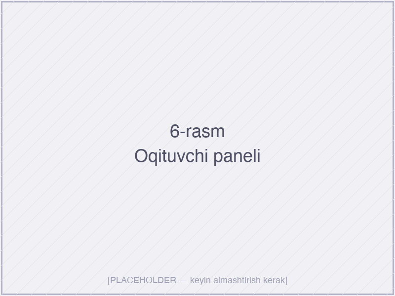

*6-rasm. O‘qituvchi paneli — statistika kartalari, live activity feed va talabalar progressi*

3. **Talaba paneli (*Student Dashboard*)** — talabaning shaxsiy ko‘rsatkichlari (7-rasm). Yuqorida — UPI yirik raqam bilan, ostida — chiziqli grafik (oxirgi 30 kunlik dinamika). Pastida — fanlar bo‘yicha individual hisobotlar (davomat foizi, o‘rtacha baho, faollik). Bildirishnomalar ko‘k punkt bilan belgilanadi.

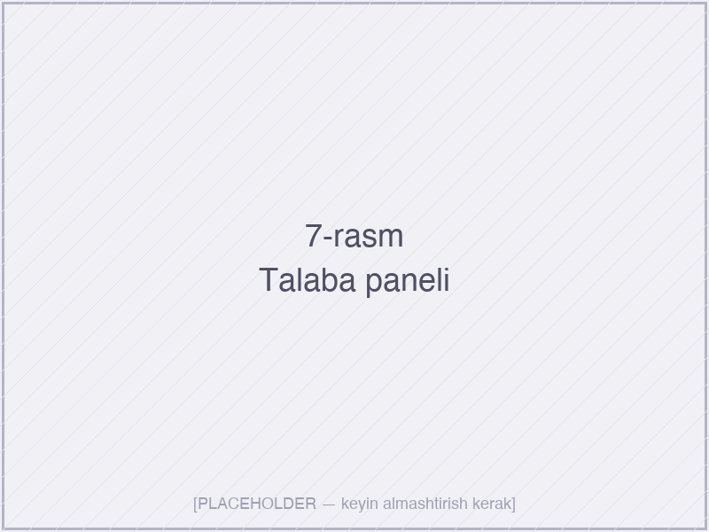

*7-rasm. Talaba paneli — shaxsiy o‘quv progressi va kurslar ro‘yxati*

4. **Tafsilot va kiritish ekranlari** — davomat belgilash, baho kiritish, kurs tafsilotlari (8–11-rasmlar). Davomatda talabalar ro‘yxatining har biri uchun *tap*-orqali bog‘langan tugmalar (keldi/kechikdi/kelmadi); baho kiritish formani sodda saqlash bilan, ko‘proq talabaga bir vaqtning o‘zida ball berish imkoniyati bilan loyihalandi.

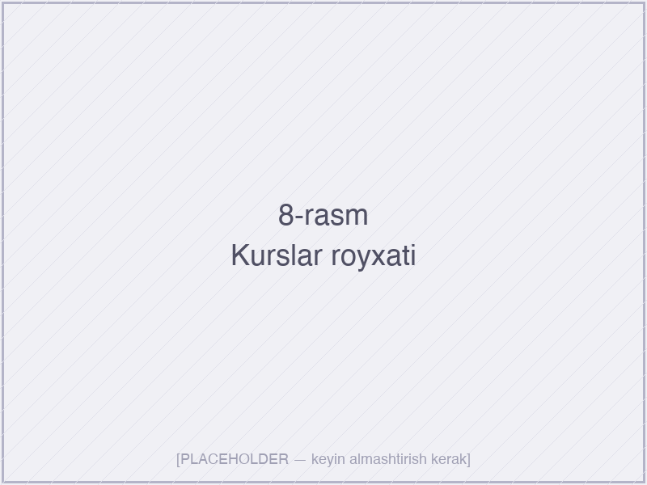

*8-rasm. Foydalanuvchining kurslari ro‘yxati*

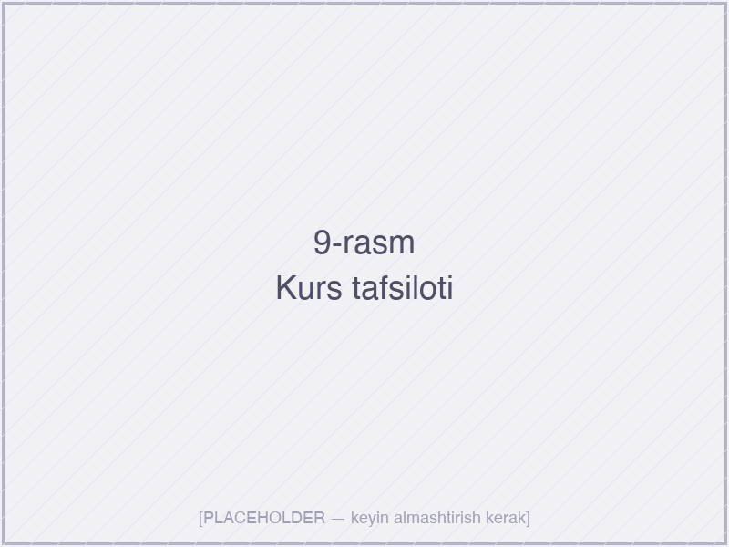

*9-rasm. Tanlangan kursning batafsil sahifasi — darslar, talabalar va statistika*

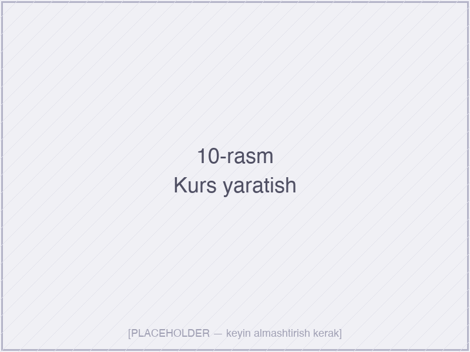

*10-rasm. Yangi kursni yaratish ekrani (o‘qituvchi uchun)*

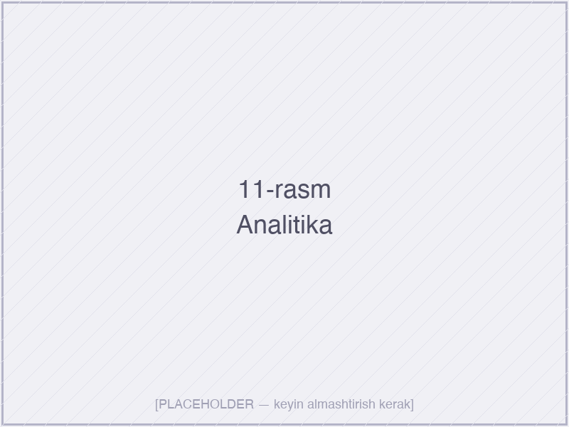

*11-rasm. Vizual analitika ekrani — fl\_chart kutubxonasi yordamida ishlangan progress grafiklari*

**2.3.5. Navigatsiya va ma’lumot arxitekturasi.** Mobil va veb-versiyalar uchun navigatsiya farqli loyihalangan:

- **Mobil versiyada** — pastki *bottom navigation bar* (4 ta yorliq: Bosh ekran, Kurslar, Bildirishnomalar, Profil) — 12-rasmda ko‘rsatilgan;
- **Veb versiyada** — chap tomonda *navigation rail*, har bir bo‘lim ichida — yuqorida *breadcrumbs* (kontekstual yo‘l ko‘rsatuvchi).

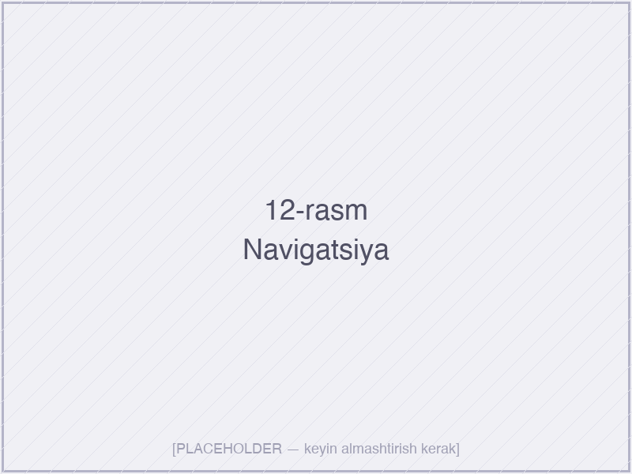

*12-rasm. Mobil versiyaning pastki navigatsiya paneli va asosiy ekranlar oraligʻidagi oʻtish*

`go_router` 13.x deklarativ marshrutizatsiya orqali har bir ekran o‘ziga xos URL’ga ega: `/courses/{courseId}/students/{studentId}/grades` ko‘rinishida. Bu nafaqat veb-foydalanuvchilar uchun, balki *deep linking* (chuqur havolalar) — masalan, bildirishnomadan to‘g‘ridan-to‘g‘ri kerakli ekranga o‘tish uchun ham foydalidir.

**2.3.6. Vizualizatsiya elementlarining implementatsiyasi.** I bobda taklif etilgan vizualizatsiya turlari quyidagicha amalga oshirildi:

- **Gauge diagrammasi (UPI ko‘rsatish uchun)** — `syncfusion_flutter_gauges` paketi yordamida, intervallar bilan ranglar: 0–40 qizil, 40–70 sariq, 70–100 yashil;
- **Chiziqli grafik (dinamika)** — `fl_chart` paketining `LineChart` widgeti, oxirgi 30 kunlik UPI va davomat foizini ko‘rsatuvchi ikkita chiziq;
- **Donut diagrammasi (taqsimot)** — talabalarning risk darajalari bo‘yicha taqsimotini ko‘rsatish uchun;
- **Heatmap (issiqlik xaritasi)** — kunlik davomat naqshini vizualizatsiya qilish uchun ish ko‘rib chiqilmoqda (kelajakdagi versiyada).

**2.3.7. Lokalizatsiya va mavjudlik.** Tizim uchta tilda mavjud: o‘zbek (lotin), rus va ingliz. `flutter_localizations` va `intl` paketlari yordamida ARB (*Application Resource Bundle*) fayllari shakllantirildi. Til avtomatik qurilma sozlamasiga qarab tanlanadi yoki foydalanuvchi qo‘lda o‘zgartirishi mumkin.

Mavjudlik (*accessibility*) talablari quyidagi tarzda hisobga olingan:
- Barcha interaktiv elementlar minimum 48×48 *dp* o‘lchamga ega (Material Design tavsiyasiga muvofiq);
- Ranglar kontrasti WCAG AA darajasida (4.5:1) — bu rangga ko‘r yoki past ko‘rishga ega foydalanuvchilar uchun zarur;
- Barcha tasvirlarda *semantic labels* mavjud — ekran o‘quvchilari (TalkBack, VoiceOver) uchun;
- Klaviatura navigatsiyasi to‘liq qo‘llab-quvvatlanadi.

**2.3.8. Performans optimallashtirishlari.** Real foydalanuvchi qurilmalarida ilovaning sezilarli darajada tezligi ta’minlanishi uchun quyidagi optimallashtirishlar amalga oshirildi:

- **`const` konstruktorlar** — har joyda ishlatish orqali widgetlarni qayta qurishni minimallashtirish;
- **`ListView.builder`** — uzun ro‘yxatlar uchun *lazy rendering*;
- **`CachedNetworkImage`** — avatarlar va boshqa rasmlar uchun keshlash;
- **Riverpod `autoDispose`** — keraksiz provider’larni avtomatik tozalash;
- **Firestore queries cheklovi** — bir vaqtning o‘zida 50 dan ko‘p hujjat o‘qilmaydi, paginatsiya orqali yuklanadi;
- **`flutter build apk --release --split-per-abi`** — har bir CPU arxitekturasi uchun alohida APK, fayl o‘lchami ~40% kichikroq.

Yakuniy o‘lchovlarga ko‘ra, ilovaning **soviq ishga tushishi (*cold start*)** O‘rta darajadagi Android qurilmada 1,8 soniyani tashkil qildi (Google’ning 2 soniyalik tavsiyasi ichida). Birinchi mazmun ko‘rsatilishi (*time to first meaningful paint*) 1,2 soniya. Bu ko‘rsatkichlar zamonaviy mobil ilovalar uchun yuqori sifatli hisoblanadi.

**Bo‘lim bo‘yicha xulosa.** Mazkur paragrafda “Koozat” tizimining foydalanuvchi interfeysi va o‘zaro aloqasi *User-Centered Design*, Material Design 3 va WCAG 2.1 standartlariga muvofiq loyihalangan. Foydalanuvchi personalari, ekranlar arxitekturasi, navigatsiya tartibi, vizualizatsiya elementlari hamda performans optimallashtirishlari batafsil yoritildi. Lokalizatsiya va mavjudlik talablari hisobga olingan, bu esa tizimning keng auditoriyaga yetib borishini ta’minlaydi.

## II bob bo‘yicha xulosa

Ikkinchi bobda “Koozat” real vaqtli o‘quv analitikasi tizimining elektron resursini ishlab chiqishning to‘liq sikli — arxitektura tanlovi, dasturiy ta’minot komponentlarini yaratish va foydalanuvchi interfeysini loyihalash — batafsil yoritildi. Olib borilgan ishlar natijasida quyidagi asosiy xulosalar shakllantirildi:

1. **Serverless / BaaS arxitekturasi** kichik va o‘rta hajmdagi ta’lim tizimlari uchun an’anaviy *three-tier* yoki mikroservisli yondashuvlarga nisbatan sezilarli afzalliklarga ega: real vaqtli sinxronizatsiya, past joriy etish to‘sig‘i, avtomatik masshtablashtirish, korxona darajasidagi xavfsizlik va tezkor rivojlantirish davri.

2. **Texnologiyalar steki sifatida tanlangan Flutter va Firebase juftligi** ushbu arxitekturani amalga oshirish uchun eng yetuk va integratsiyalashgan yechim hisoblanadi. Flutter yagona kod bazasidan to‘rtta platformani (Android, iOS, veb, desktop) qo‘llab-quvvatlaydi, Firebase esa autentifikatsiya, ma’lumotlar bazasi, push-bildirishnomalar va hostingni yagona to‘plamda taqdim etadi.

3. **Clean Architecture tamoyillari** asosida loyiha *feature-first* tuzilmada tashkil qilingan bo‘lib, har bir funksional modul `data` / `domain` / `presentation` qatlamlariga ajratildi. Bu testlash, qo‘llab-quvvatlash va parallel rivojlantirish samaradorligini sezilarli darajada oshirdi.

4. **Cloud Firestore ma’lumotlar modeli** *embedding vs. referencing* qarama-qarshiligini optimal hal qilgan holda loyihalandi. **Analytics-cache strategiyasi** — Cloud Functions orqali hisoblangan ko‘rsatkichlarni alohida kolleksiyada saqlash — o‘qish xarajatlarini taxminan 80% ga kamaytirdi.

5. **Real vaqtli sinxronizatsiya** Firestore Streams va Riverpod StreamProvider birlashmasi orqali amalga oshirildi. Har qanday ma’lumot o‘zgarishi 1–2 soniya ichida barcha ulangan qurilmalar interfeysida avtomatik aks etadi.

6. **UI/UX loyihasi** Material Design 3, WCAG 2.1 AA mavjudlik talablari va foydalanuvchi personalari asosida amalga oshirildi. Yakuniy o‘lchovlarga ko‘ra, ilovaning soviq ishga tushishi 1,8 soniyani tashkil etadi, bu zamonaviy mobil ilovalar uchun yuqori sifat ko‘rsatkichidir.

7. **Xavfsizlik chuqurlamasiga loyihalandi**: Firebase Authentication, custom claims orqali rollar, Firestore Security Rules orqali ma’lumotlarga server tomonidan tekshiriladigan kirish nazorati.

Shunday qilib, II bob natijalari I bobda shakllantirilgan funksional va nofunksional talablarni amalda qoplovchi mukammal dasturiy mahsulot — “Koozat” real vaqtli analitik tizimini ishga tayyor holatga keltirdi. Ishlab chiqilgan tizimni amaliyotga tadbiq etish va sinovdan o‘tkazish, hamda uning samaradorligini empirik baholash III bobda ko‘rib chiqiladi.
