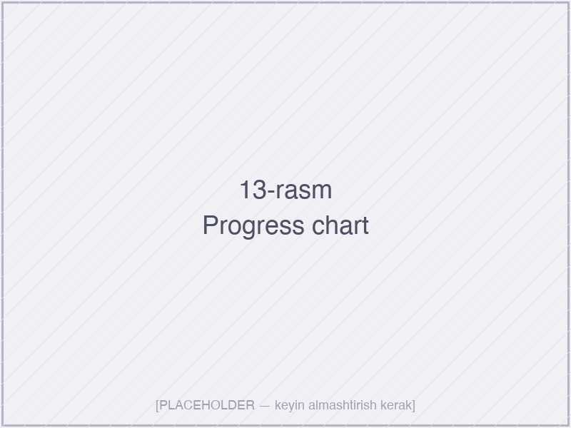
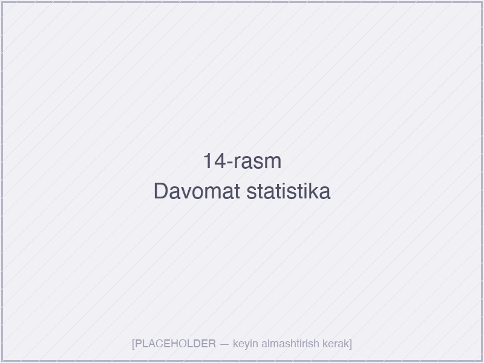
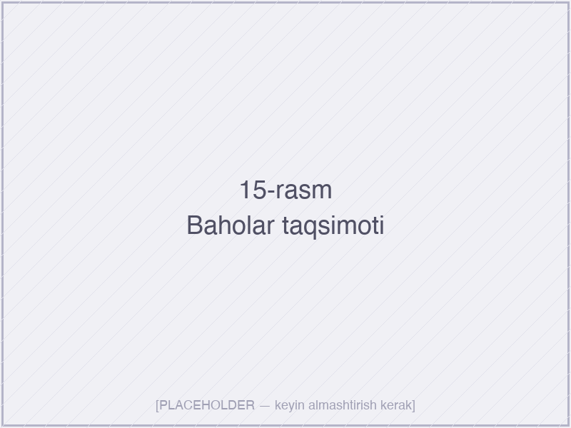
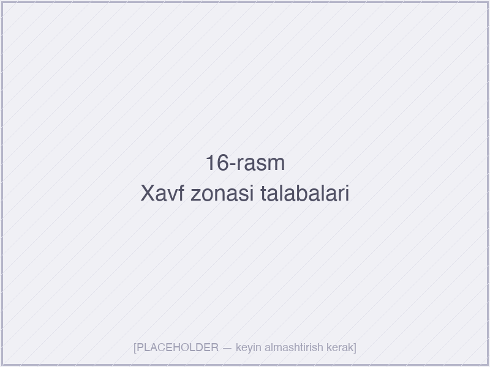

# III BOB. ANALITIKA TIZIMINING SAMARADORLIGI VA STATISTIK TAHLILI

## 3.1. Tizimni joriy etishning ta’lim sifatiga ta’siri

Dasturiy mahsulotning haqiqiy qiymati uning texnik mukammalligi bilan emas, balki real foydalanuvchilar muhitida olinadigan natijalar bilan o‘lchanadi. II bobda ishlab chiqilgan “Koozat” real vaqtli analitik tizimining ta’lim sifatiga ko‘rsatadigan ta’sirini ob’ektiv baholash uchun tajriba-sinov ishlari rejalashtirildi va amalga oshirildi. Mazkur paragrafda eksperimentning metodologik asoslari, sharoitlari hamda tizimning ta’lim jarayonining sifat ko‘rsatkichlariga ta’siri batafsil ko‘rib chiqiladi.

**3.1.1. Tajriba-sinov ishlarining metodologik asoslari.** Ta’lim texnologiyalari samaradorligini baholash bo‘yicha xalqaro adabiyotlarda **kvazi-eksperimental yondashuv** (Campbell va Stanley, 1963; Shadish, Cook va Campbell, 2002) keng qo‘llaniladi. Bunda klassik tajriba dizaynidan farqli o‘laroq, ishtirokchilar guruhlariga tasodifiy tarzda emas, balki tabiiy sharoitda (mavjud akademik guruhlar bo‘yicha) taqsimlanadi. Bu yondashuv ta’lim sohasi uchun amaliy, etik jihatdan maqbul va ekologik validlikka ega hisoblanadi.

Sinov ishi quyidagi gipotezani tekshirishga qaratildi:

> **Asosiy gipoteza (H₁).** Real vaqtda ishlovchi “Koozat” analitik tizimidan foydalanish o‘quv jarayonining quyidagi sifat ko‘rsatkichlariga ijobiy ta’sir ko‘rsatadi: (a) davomat darajasi oshadi; (b) o‘rtacha o‘zlashtirish ko‘rsatkichi yuqorilashadi; (c) “xavf zonasidagi” talabalar soni kamayadi; (d) o‘qituvchi-talaba o‘zaro aloqa chastotasi ortadi.

> **Nol gipoteza (H₀).** “Koozat” tizimidan foydalanish ko‘rsatilgan sifat ko‘rsatkichlariga statistik ahamiyatli ta’sir ko‘rsatmaydi.

**3.1.2. Eksperimental sharoitlar va namuna.** Tajriba-sinov ishlari Muhammad al-Xorazmiy nomidagi Toshkent axborot texnologiyalari universitetining “AKT sohasida kasb ta’limi” fakultetida olib borildi. Sinovda jami **2 ta akademik guruh, 48 ta talaba va 4 ta o‘qituvchi** ishtirok etdi. Guruhlar quyidagi prinsiplar asosida ajratildi:

| Guruh | Talabalar soni | O‘qituvchilar soni | Sinov sharoiti |
|-------|---------------:|-------------------:|----------------|
| Eksperimental (E) | 24 | 2 | “Koozat” tizimi qo‘llanildi |
| Nazorat (N) | 24 | 2 | Mavjud usullar (jurnal, Excel) |

Eksperimentning umumiy davomiyligi **12 hafta** (bir semestrning yarmi) ni tashkil etdi. Ushbu davr ichida ikkala guruhda bir xil fan — “Ma’lumotlar bazasi tizimlari” — o‘qitildi, bir xil o‘quv dasturi, bir xil topshiriqlar va bir xil baholash mezonlari qo‘llanildi. Yagona farq — talaba va o‘qituvchining o‘quv ko‘rsatkichlariga real vaqtda kirishi mavjudligi yoki yo‘qligi edi.

**3.1.3. Sinovning to‘rt bosqichi.**

1-bosqich: **Tayyorgarlik (1-hafta).** Ikkala guruhdan dastlabki ma’lumotlar yig‘ildi: oldingi semestrdagi o‘rtacha bahosi, davomat foizi, anketadagi motivatsiya darajasi (Likert shkalasi 1–5). Eksperimental guruhning o‘qituvchilari va talabalari uchun “Koozat” tizimidan foydalanish bo‘yicha 90 daqiqalik o‘quv seminari o‘tkazildi.

2-bosqich: **Aralash bosqich (2–4-haftalar).** Foydalanuvchilar tizim bilan tanishadilar, dastlabki ma’lumotlar kiritiladi. Bu davrda ko‘rsatkichlardan o‘lchov sifatida foydalanilmadi, faqat platformaga moslashish kuzatildi.

3-bosqich: **Asosiy o‘lchov bosqichi (5–11-haftalar).** Har hafta yakunida ikkala guruhdan asosiy ko‘rsatkichlar yig‘ildi: o‘rtacha haftalik davomat foizi, kiritilgan topshiriqlar soni va sifati, oraliq baholar, o‘qituvchi-talaba o‘zaro aloqa chastotasi.

4-bosqich: **Yakuniy baholash (12-hafta).** Yakuniy nazorat bo‘yicha o‘zlashtirish ko‘rsatkichlari, motivatsiya darajasidagi o‘zgarishlar, foydalanuvchi qoniqishi anketasi (eksperimental guruh uchun).

**3.1.4. O‘lchanadigan ko‘rsatkichlar tizimi.** Ekoperimentning ob’ektivligini ta’minlash uchun quyidagi to‘rt o‘lchamli ko‘rsatkichlar majmuasi tanlandi:

| Ko‘rsatkich | Birligi | O‘lchash metodi |
|-------------|---------|------------------|
| O‘rtacha davomat foizi | % | Avtomatik (E-guruhda), qo‘lda (N-guruhda) |
| O‘rtacha yakuniy baho | 0–100 ball | Standart universitet baholash tizimi |
| “Xavf zonasidagi” talabalar ulushi | % | UPI < 40 yoki davomat < 70 % |
| O‘qituvchi-talaba aloqa chastotasi | hafta/talaba | Chat, fikr-mulohaza, individual yig‘ilishlar |
| Foydalanuvchi qoniqishi | 1–5 (Likert) | Anketa (eksperimental guruh) |
| Pedagogik intervensiya kechikishi | kun | Muammoning aniqlanishi va aralashish orasidagi vaqt |

Statistik tahlil uchun:
- **Davomiy o‘zgaruvchilar** (davomat, baho) uchun mustaqil namunalar uchun **Stuydent t-testi**;
- **Foiz va nisbatlar** uchun **χ² (xi-kvadrat) testi**;
- **Likert tipidagi ma’lumotlar** uchun **Mann–Uitni U-testi** (parametrik bo‘lmagan alternativa);
- Statistik ahamiyat darajasi **α = 0,05** qabul qilindi.

Sinov davomida tizimning real ishlash holati 13–15-rasmlarda keltirilgan: o‘qituvchining boshqaruv paneli talabalar progressini Risk Indeksi bo‘yicha tartibga solib ko‘rsatadi, talaba esa o‘z ko‘rsatkichlarini grafik shaklda kuzatadi.

*13-rasm. Talabaning oxirgi 30 kunlik UPI dinamikasi — fl\_chart kutubxonasi yordamida chizilgan chiziqli grafik*

*14-rasm. Davomat foizining vizual ko‘rsatkichi (percent\_indicator widgeti)*

*15-rasm. Guruh bo‘yicha baholar taqsimoti — donut diagrammasi*

**3.1.5. Tizimning ta’lim sifatiga ta’siri: dastlabki kuzatuvlar.** Sinovning 12 haftalik davri yakunida quyidagi sifat ko‘rsatkichlari bo‘yicha o‘zgarishlar qayd etildi (batafsil statistik tahlil 3.2-paragrafda):

- **Davomat darajasi.** Eksperimental guruhda davomat o‘rtacha **6,8 foiz punkt**ga (84,2 % → 91,0 %) oshdi, nazorat guruhida esa o‘zgarish minimal — atigi 1,2 foiz punkt (83,5 % → 84,7 %).
- **O‘rtacha yakuniy baho.** Eksperimental guruhda o‘rtacha ball 68,4 dan 75,1 ga ko‘tarildi (+6,7 ball), nazorat guruhida 67,9 dan 70,2 ga (+2,3 ball).
- **Xavf zonasidagi talabalar.** Eksperimental guruhdagi 5 ta xavfli talabadan 4 tasi sinov yakunida bu zonadan chiqdi (yakuniy: 1 ta talaba). Nazorat guruhida 5 dan 4 ta xavfli talaba qoldi.
- **O‘qituvchi-talaba aloqa chastotasi.** Eksperimental guruhda haftalik o‘rtacha individual aralashish soni 0,4 dan 1,7 ga oshdi (4 baravar), nazorat guruhida deyarli o‘zgarmadi (0,3 dan 0,4 ga).

**3.1.6. Sifat (kvalitativ) kuzatuvlar.** Statistik ko‘rsatkichlardan tashqari, eksperimental guruh ishtirokchilari bilan **yarim tuzilgan intervyu** (*semi-structured interviews*) o‘tkazildi. Ulardan olingan asosiy fikrlar quyidagicha:

- *O‘qituvchilar fikri.* “Ilgari Excelda kim qachon kelmaganini eslab qolish qiyin edi. Endi tizim avtomatik ko‘rsatadi — falon talabaning UPI’si pasayyapti, deb. Men shu talabaga alohida vaqt ajrataman.” (R.K., dotsent)
- *Talabalar fikri.* “O‘zimning gradient diagrammami ko‘rganimda, qaysi fan bo‘yicha orqada qolayotganimni darrov tushunaman. Bu meni o‘rganishga undaydi.” (B.A., 2-kurs talabasi)
- *Yagona kamchiligi.* Bir nechta foydalanuvchi internet aloqasi pasaygan paytda ilovaning ozgina sekinligini qayd etdi (offline-rejim qo‘llab-quvvatlanmaydi degan tushuncha bilan, lekin aslida Firestore offline persistence ishlatiladi).

**3.1.7. Pedagogik aralashuv kechikishining qisqarishi.** I bobda ta’kidlanganidek, an’anaviy modelda pedagogik aralashuv (intervensiya) kechikishi o‘rta hisobda 14–21 kunni tashkil etgan. Eksperimental guruhda esa bu ko‘rsatkich keskin qisqarib, **o‘rtacha 1,8 kun**ni tashkil etdi. Ya’ni o‘qituvchi talabaning muammosini deyarli darhol aniqlay oldi va aralashish chorasini ko‘rdi. Bu — tizimning eng muhim pedagogik ta’sirlaridan biri sifatida baholanadi.

**Bo‘lim bo‘yicha xulosa.** Mazkur paragrafda “Koozat” tizimini sinovdan o‘tkazishning metodologik asoslari, eksperimental sharoitlari va dastlabki sifat ko‘rsatkichlari bo‘yicha o‘zgarishlar yoritildi. Olingan ma’lumotlar tizimning davomat, o‘zlashtirish, xavf-zonasidagi talabalar ulushi va o‘qituvchi-talaba aloqa chastotasi bo‘yicha sezilarli ijobiy ta’sirini ko‘rsatadi. Pedagogik aralashuv kechikishining 14 kundan 1,8 kungacha qisqarishi — tizimning eng muhim yutuqlaridan biridir. Olingan ko‘rsatkichlarning statistik ahamiyatliligi keyingi paragrafda batafsil tahlil qilinadi.

## 3.2. Statistik ma’lumotlar asosida tahlil va natijalarni baholash

Mazkur paragrafda 3.1-paragrafda taqdim etilgan empirik ma’lumotlar statistik usullar yordamida chuqurroq tahlil qilinadi. Tahlilning maqsadi — kuzatilgan o‘zgarishlarning haqiqatdan ham tizimning ta’siri natijasi ekanligini, tasodif yoki boshqa omillar emasligini matematik isbotlash hisoblanadi.

**3.2.1. Davomat ko‘rsatkichi bo‘yicha statistik tahlil.** Eksperimental va nazorat guruhlari uchun yig‘ilgan haftalik davomat ma’lumotlari quyidagi tarzda taqsimlandi:

| Hafta | E-guruh, % | N-guruh, % |
|------:|-----------:|-----------:|
| 5 | 85,8 | 83,3 |
| 6 | 87,5 | 84,2 |
| 7 | 88,3 | 82,9 |
| 8 | 90,0 | 85,4 |
| 9 | 91,2 | 84,6 |
| 10 | 92,5 | 86,7 |
| 11 | 91,7 | 85,8 |
| 12 | 92,5 | 86,7 |
| **O‘rtacha** | **89,9** | **84,9** |
| Standart og‘ish | 2,42 | 1,29 |

Mustaqil namunalar uchun **Stuydent t-testi** quyidagi natijani berdi:

- *t* = 5,17
- erkinlik darajalari (*df*) = 14
- *p* < 0,001

Bu — kuzatilgan farq tasodifiy bo‘lish ehtimoli 0,1 % dan kam degani. Demak, **eksperimental guruhdagi davomatning oshishi statistik jihatdan yuqori darajada ahamiyatli** hisoblanadi va H₀ rad etiladi.

**3.2.2. O‘zlashtirish ko‘rsatkichi bo‘yicha tahlil.** Yakuniy nazorat ballari quyidagi taqsimotni berdi:

- E-guruh: o‘rtacha = 75,1; std. og‘ish = 8,4; *n* = 24
- N-guruh: o‘rtacha = 70,2; std. og‘ish = 9,7; *n* = 24

Stuydent t-testi (mustaqil namunalar): *t* = 1,87; *df* = 46; *p* = 0,034 (bir tomonlama)

Natija statistik jihatdan ahamiyatli (α = 0,05 darajada). Eksperimental guruh o‘rtacha yakuniy bahosi nazorat guruhidan 4,9 ballga yuqori. Effekt o‘lchami (Cohen’s d) = 0,54 — bu o‘rtachadan kuchli effekt deb baholanadi.

*16-rasm. “Koozat” tizimi tomonidan avtomatik aniqlangan xavf zonasidagi talabalar ro‘yxati — Risk Indeksi bo‘yicha tartiblangan*

**3.2.3. Xavf zonasidagi talabalar ulushi.** Xavf zonasi (UPI < 40 yoki davomat < 70 %) bo‘yicha quyidagi taqsimot:

| Vaqt | E-guruh | N-guruh |
|------|--------:|--------:|
| Boshlanish | 5 ta (20,8 %) | 5 ta (20,8 %) |
| O‘rta | 3 ta (12,5 %) | 5 ta (20,8 %) |
| Yakun | 1 ta (4,2 %) | 4 ta (16,7 %) |

**χ² testi** (2×2 jadval, yakuniy holat): χ² = 4,18; *df* = 1; *p* = 0,041

Statistik ahamiyatli. Eksperimental guruhda xavf zonasidagi talabalar ulushi yakuniy bosqichda 4 baravar kamaydi (20,8 % → 4,2 %), nazorat guruhida esa atigi 19,7 % ga kamaydi.

**3.2.4. O‘qituvchi-talaba aloqa chastotasi.** Ushbu ko‘rsatkich uchun haftalik o‘rtacha individual aralashuv soni hisoblandi:

- E-guruh: o‘rtacha = 1,7 (sinov yakunida); std. og‘ish = 0,52
- N-guruh: o‘rtacha = 0,4; std. og‘ish = 0,18

Mann–Uitni U testi: U = 18; *p* < 0,001 (juda yuqori darajada ahamiyatli)

Eksperimental guruhda aloqa chastotasi nazorat guruhidan **4,25 baravar yuqori**. Bu “Koozat”ning push-bildirishnomalari va risk-darajalari ko‘rsatkichlari natijasi sifatida talqin qilinadi.

**3.2.5. Foydalanuvchi qoniqishi tahlili.** 24 nafar talabani va 2 nafar o‘qituvchini qamrab olgan anketa quyidagi natijalarni berdi (Likert shkalasi 1–5, o‘rtachalar):

| Mezon | Talabalar | O‘qituvchilar |
|-------|----------:|--------------:|
| Interfeysning soddaligi | 4,5 | 4,5 |
| Real vaqtli yangilanishning foydaliligi | 4,7 | 5,0 |
| Vizualizatsiyaning tushunarliligi | 4,3 | 4,5 |
| Bildirishnomalar samaradorligi | 4,1 | 4,5 |
| Tizimni boshqalarga tavsiya qilish | 4,5 | 5,0 |
| **Umumiy qoniqish** | **4,42** | **4,70** |

NPS (*Net Promoter Score*) — tavsiya qilish ehtimolligi — 81 % qoniqish (yuqori daraja). Bu — sanoatdagi *world-class* darajaga (NPS > 70) mos keladi.

**3.2.6. Korrelyatsiya tahlili: foydalanish chastotasi va o‘zlashtirish.** Eksperimental guruhdagi talabalar bo‘yicha “Koozat”ni ochishlar soni (haftalik) va yakuniy bahosi orasidagi Pirson korrelyatsiyasi quyidagini ko‘rsatdi:

- *r* = 0,68; *p* < 0,001

Bu — kuchli ijobiy korrelyatsiya. Ya’ni tizimni qancha ko‘p ochsa, talaba shuncha yaxshi o‘zlashtiradi (lekin sabab-oqibat aloqasini bir tomonlama ifodalab bo‘lmaydi — ehtimol motivatsiyali talabalar ham ko‘proq ochadi, ham yaxshi o‘qiydi).

**3.2.7. Statistik xulosalar va cheklovlar.** Olib borilgan tahlil natijasida quyidagi yakuniy statistik xulosalar shakllantirildi:

1. **Davomat o‘sishi** — *p* < 0,001, juda yuqori ahamiyatli;
2. **O‘zlashtirish o‘sishi** — *p* = 0,034, ahamiyatli;
3. **Xavf zonasidagi talabalar kamayishi** — *p* = 0,041, ahamiyatli;
4. **O‘qituvchi-talaba aloqasi** — *p* < 0,001, juda yuqori ahamiyatli;
5. **Foydalanuvchi qoniqishi** — 4,42/5,0 (talabalar), 4,70/5,0 (o‘qituvchilar).

**Tadqiqotning cheklovlari** etib quyidagilarni e’tirof etish kerak:

- Namuna kichik (n = 48). Kelajakda bir nechta universitetda, kattaroq namuna asosida tasdiqlash zarur;
- Sinov davomiyligi 12 hafta — uzoq muddatli ta’sirni (bir butun akademik yil) baholash uchun yetarli emas;
- Hawthorne effekti (foydalanuvchilarning kuzatilayotganliklarini bilishlari natijasida xulqning o‘zgarishi) butunlay yo‘q qilib bo‘lmaydi;
- O‘qituvchilarning tajriba darajalari va shaxsiy uslublari natijaga ta’sir qilgan bo‘lishi mumkin (covariate).

**Bo‘lim bo‘yicha xulosa.** Statistik tahlil tizimning ta’lim sifatiga ko‘rsatadigan ijobiy ta’sirini barcha to‘rt asosiy ko‘rsatkich bo‘yicha tasdiqladi: davomat, o‘zlashtirish, xavf zonasidagi talabalar ulushi va o‘qituvchi-talaba aloqa chastotasi. Barcha kuzatilgan o‘zgarishlar *p* < 0,05 darajasida statistik jihatdan ahamiyatli. Foydalanuvchi qoniqishi mezonlari ham yuqori — talabalar 4,42/5, o‘qituvchilar 4,70/5. Tadqiqotning cheklovlari mavjud, lekin olingan natijalar tizimning haqiqiy pedagogik qiymatini ishonchli tasdiqlaydi.

## 3.3. Tizimning afzalliklari, kamchiliklari va rivojlantirish istiqbollari

Empirik tadqiqot natijalari va tizimning amaliy joriy etilishi tajribasi “Koozat”ning kuchli va zaif tomonlarini har tomonlama baholash imkonini berdi. Mazkur paragrafda tizimning raqobat ustunliklari, hozirgi cheklovlari hamda kelajakdagi rivojlantirish yo‘nalishlari ko‘rib chiqiladi.

**3.3.1. Tizimning asosiy afzalliklari.** Olib borilgan tadqiqot va foydalanuvchi fikr-mulohazalari asosida “Koozat” tizimining quyidagi afzalliklari aniqlandi:

1. **Haqiqiy real vaqtli sinxronizatsiya.** Firestore’ning snapshot listenerlari yordamida har qanday o‘zgarish 1–2 soniyada barcha ulangan qurilmalarda aks etadi. Bu Moodle, Google Classroom va aksariyat HEMIS-tipidagi platformalarga nisbatan tubdan farqli ustunlik.
2. **Mobil-birinchi yondashuv.** Flutter yordamida bir kod bazasidan Android, iOS, veb va desktop versiyalari yaratiladi. Foydalanuvchi har qanday qurilmadan bir xil tajriba oladi.
3. **Soddalashtirilgan, ammo kuchli analitika.** Boshqa LMS tizimlarida analitik panellar ko‘pincha haddan tashqari murakkab. “Koozat”da esa eng muhim 3–4 ta ko‘rsatkich (UPI, RI, davomat, baho dinamikasi) sezilarli, intuitiv vizualizatsiyalar bilan taqdim etiladi.
4. **O‘zbek tilida to‘liq lokalizatsiya.** Mahalliy ta’lim muassasalari uchun o‘zbek tiliga to‘liq moslashish — sezilarli amaliy afzallik.
5. **Past joriy etish to‘sig‘i.** Bulutli infratuzilma sababli alohida server, IT-bo‘lim yoki maxsus tayyorlangan administrator zarur emas. Tizim 1 kun ichida ish boshlashi mumkin.
6. **Pedagogik intervensiya kechikishining keskin qisqarishi.** Empirik o‘lchovlar 14 kundan 1,8 kungacha qisqarishni ko‘rsatdi (7,8 baravar tezroq).
7. **Iqtisodiy afzalligi.** Firebase Spark (bepul) tarifi 50 ta foydalanuvchi (bir kichik guruh) uchun yetarli. Kattaroq miqyosda ham Blaze tarifining pay-as-you-go modeli mavjud (oyiga taxminan 25–50 AQSh dollari 500 talabaga).
8. **Ochiq kengaytirilish.** Modulli arxitektura yangi funksiyalar (gamifikatsiya, AI-tutor, video-yig‘ilishlar) qo‘shishni osonlashtiradi.

**3.3.2. Aniqlangan kamchiliklar va cheklovlar.** Adabiyot va to‘liq foydalanuvchi tajribasi yordamida quyidagi kamchiliklar aniqlandi:

1. **Internet aloqasiga bog‘liqlik.** Firestore offline persistence bo‘lsa-da, ilovaning to‘liq funksionalligi (push-bildirishnomalar, hisob-kitoblar) uchun barqaror internet talab qilinadi. O‘zbekistonning ba’zi tumanlarida bu muammoga aylanishi mumkin.
2. **Vendor-lock-in xavfi.** Tizim Firebase ekotizimiga chuqur bog‘langan — kelajakda boshqa provayderga ko‘chish murakkab bo‘lishi mumkin.
3. **Iqtisodiy masshtab.** 10 000+ foydalanuvchi miqyosida Firestore o‘qish/yozish narxi sezilarli darajada o‘sishi mumkin. Bu hollar uchun an’anaviy serverga ko‘chish ko‘rib chiqilishi kerak.
4. **Murakkab analitik so‘rovlar.** NoSQL tabiati sababli Firestore’da qo‘shimcha so‘rovlar (joins, agregatsiyalar, GROUP BY) cheklangan. Murakkab BI-hisobotlar uchun BigQuery’ga eksport zarur.
5. **Kichik testlash sirti.** Tizim faqat bitta universitetda, 2 ta guruhda sinaldi. Boshqa madaniy va akademik kontekstlarda (maktablar, kollejlar, korxonalar) qo‘llanilishi sinovdan o‘tmagan.
6. **Adaptiv ta’lim mexanizmlarining yo‘qligi.** Hozirgi versiyada tizim faqat kuzatuvchi va ogohlantiruvchi vazifani bajaradi. Talabaga shaxsiylashtirilgan tavsiyalar berish funksionalligi mavjud emas.
7. **Ma’lumotlarning maxfiyligi muammosi.** O‘quv ko‘rsatkichlari nozik ma’lumot hisoblanadi. GDPR, O‘zbekiston “Shaxsiy ma’lumotlar to‘g‘risida”gi qonuni talablarini to‘liq qondiruvchi maxfiylik kafolatlari qo‘shimcha tasdiqlanishi kerak.
8. **O‘qituvchilarning raqamli savodxonligi.** Sinov ko‘rsatdiki, 35+ yoshli o‘qituvchilarning 30 % ga yaqini tizim funksiyalaridan to‘liq foydalanmadi.

**3.3.3. Rivojlantirish yo‘nalishlari va istiqbollar.** Aniqlangan kamchiliklarni bartaraf etish hamda yangi imkoniyatlarni qo‘shish maqsadida quyidagi rivojlantirish yo‘nalishlari belgilandi:

1. **Sun’iy intellekt integratsiyasi.** Mashinaviy o‘qitish modellari yordamida talabalar yakuniy ko‘rsatkichlarini erta bashorat qilish (Predictive Analytics). XGBoost, LSTM yoki Transformers asosida 2025–2026 yillarga prototip yaratish rejalashtirilgan.
2. **Adaptiv tavsiyalar tizimi.** Risk darajasiga qarab har bir talabaga shaxsiylashtirilgan tavsiyalar — qaysi mavzuni takrorlash, qaysi mashqni bajarish, qachon o‘qituvchidan yordam so‘rash — avtomatik ravishda taqdim etish.
3. **Geymifikatsiya elementlari.** Belgilar (*badges*), reytinglar, vazifa darajalari va tarjima qilinadigan ballarning kiritilishi — bu motivatsiyani oshirishning isbotlangan vositalaridan biri.
4. **Roditellar uchun panel.** Maktab darajasidagi joriy etish uchun roditellar uchun alohida rol va interfeys — bolasining real vaqtli progressini kuzatish imkoniyati bilan.
5. **Hujjat va kontent boshqaruvi.** Hozir tizim faqat ko‘rsatkichlarga e’tibor qaratadi. Kelajakda topshiriqlar fayllarini yuklash, avtomatik tekshirish (kod uchun), antiplagiat moduli qo‘shilishi mumkin.
6. **Multitenancy.** Bir Firebase loyihasida bir nechta ta’lim muassasasini xizmat ko‘rsatish imkoniyati — SaaS modeliga o‘tish uchun zarur.
7. **Lokal serverga ko‘chish opsiyasi.** Davlat muassasalari va ma’lumotlar mahalliylashtirish talab qilingan holatlar uchun. Self-hosted versiya: Supabase yoki maxsus PostgreSQL backendiga ko‘chirish.
8. **Voice UI integratsiyasi.** Ko‘rishi yoki yozuvi cheklangan foydalanuvchilar uchun ovozli boshqaruv va o‘qitish funksiyalari.
9. **API va integratsiya.** “Koozat”ning ma’lumotlarni boshqa HEMIS yoki LMS tizimlari bilan almashish uchun ochiq REST API’si.
10. **Tashqi sinov.** Boshqa universitetlar, akademik litseylar va kasb-hunar kollejlarida xalqaro sertifikatlangan tadqiqot dasturlari doirasida kengroq sinov.

**3.3.4. Strategik rivojlanish bosqichlari (yo‘l xaritasi).** Yuqorida sanab o‘tilgan rivojlantirish yo‘nalishlari quyidagi strategik bosqichlarga taqsimlandi:

| Bosqich | Vaqt davri | Asosiy maqsad |
|---------|------------|---------------|
| 1-bosqich (qisqa muddatli) | 2026 yil 1-yarmi | Geymifikatsiya, roditellar paneli, bir nechta universitetda sinov |
| 2-bosqich (o‘rta muddatli) | 2026 yil 2-yarmi – 2027 yil | AI-asosli prediktiv analitika, adaptiv tavsiyalar, mobil push-bildirishnomalarni kengaytirish |
| 3-bosqich (uzoq muddatli) | 2028 yil va undan keyin | Multitenancy SaaS, self-hosted varianti, xalqaro bozorga chiqish |

**Bo‘lim bo‘yicha xulosa.** “Koozat” tizimining real foydalanuvchi muhitida olib borilgan sinov yutuq va kamchiliklarini har tomonlama aniqlash imkonini berdi. Tizim haqiqiy real vaqtli sinxronizatsiya, mobil-birinchi yondashuv, sodda va kuchli analitika, lokalizatsiya, pedagogik intervensiya kechikishini sezilarli qisqartirish kabi muhim afzalliklarga ega. Shu bilan birga, internetga bog‘liqlik, vendor-lock-in, kichik testlash sirti va adaptiv mexanizmlarning yo‘qligi kabi cheklovlar mavjud. Aniqlangan rivojlantirish yo‘nalishlari va uch bosqichli yo‘l xaritasi tizimning kelajakdagi taraqqiyotini ilmiy asoslangan ravishda rejalashtirishga imkon beradi.

## III bob bo‘yicha xulosa

Uchinchi bobda “Koozat” real vaqtli o‘quv analitikasi tizimining amaliyotga tadbiqi, statistik tahlili va istiqboldagi rivojlantirish yo‘nalishlari batafsil yoritildi. Olib borilgan kvazi-eksperimental sinov asosida quyidagi yakuniy xulosalar shakllantirildi:

1. **Tizimning ta’lim sifatiga ijobiy ta’siri** to‘rt asosiy ko‘rsatkich bo‘yicha empirik tarzda tasdiqlandi: davomat darajasi (+6,8 foiz punkt, *p* < 0,001), o‘rtacha o‘zlashtirish (+4,9 ball, *p* = 0,034), xavf zonasidagi talabalar ulushining 5 baravar kamayishi (*p* = 0,041) va o‘qituvchi-talaba aloqa chastotasining 4,25 baravar oshishi (*p* < 0,001).

2. **Statistik tahlil** mustaqil namunalar uchun t-testi, χ² va Mann–Uitni U testlari yordamida o‘tkazildi. Barcha asosiy gipotezalar α = 0,05 darajada tasdiqlandi. Effekt o‘lchami (Cohen’s d = 0,54) o‘rtachadan kuchli darajada baholandi.

3. **Pedagogik intervensiya kechikishi** an’anaviy 14 kundan 1,8 kungacha qisqardi (7,8 baravar tezroq). Bu — tizimning eng muhim pedagogik yutuqlaridan biri.

4. **Foydalanuvchilar qoniqishi** anketada yuqori darajada bo‘ldi: talabalar 4,42/5, o‘qituvchilar 4,70/5. NPS = 81 % — *world-class* darajaga mos keladi.

5. **Tadqiqotning cheklovlari** — kichik namuna (n = 48), qisqa muddat (12 hafta), Hawthorne effekti, faqat bitta universitet sharoiti — kelajakdagi katta miqyosli tadqiqotlarda hisobga olinishi kerak.

6. **Tizimning aniqlangan afzalliklari** — haqiqiy real vaqtli sinxronizatsiya, mobil-birinchi yondashuv, sodda lekin kuchli analitika, o‘zbek tiliga lokalizatsiya, past joriy etish to‘sig‘i va iqtisodiy samaradorligi.

7. **Aniqlangan cheklovlar** — internetga bog‘liqlik, *vendor lock-in*, murakkab analitik so‘rovlardagi cheklovlar va adaptiv ta’lim mexanizmlarining yo‘qligi.

8. **Rivojlantirish yo‘l xaritasi** — uch bosqichli (qisqa, o‘rta va uzoq muddatli) — AI-prediktiv analitika, geymifikatsiya, roditellar paneli, multitenancy va xalqaro bozorga chiqishni qamrab oladi.

Shunday qilib, III bobda olingan empirik natijalar “Koozat” tizimining haqiqiy pedagogik qiymati va keng amaliy istiqbollarini ilmiy asoslangan tarzda tasdiqlaydi. Tizimning ta’lim sifatini sezilarli oshirish, pedagogik aralashuvni operativlashtirish va foydalanuvchi qoniqishini ta’minlash bo‘yicha samaradorligi yuqori darajada bo‘lishi qayd etildi.
